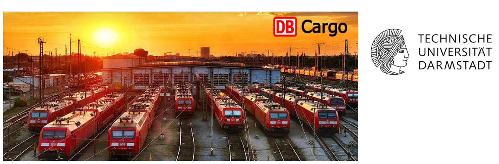

# Deutsche Bahn Data Mining Challenge

[Project Webpage](https://liuyumaosid.wixsite.com/resume-of-yumao-liu/dbmachinelearning)

<div align="center">
  
  <p><em></em></p>
</div>


## 🧪 Industrial Background

This work was conducted for the **Deutsche Bahn Data Mining Challenge** (Dec 2021 – Feb 2022) in cooperation with **DB Cargo**, Europe’s largest rail-freight operator. With the growing deployment of GNSS-enabled dataloggers across freight wagons, DB Cargo collects massive volumes of raw sensor data, including positional traces, shock events, and dynamic train compositions.

Focusing on **systemic delay analysis, predictive modeling, and actionable insights**, the project applies data mining and machine learning to extract patterns from this complex, unstructured data. The resulting models support **proactive dispatch planning**, **fleet health monitoring**, and **cost-efficient scheduling**—key elements for optimizing large-scale railway operations.


**Main Contributions:**
- Analyzed complex railway network datasets to uncover delay patterns.
- Developed a neural network-based dispatching model for delay reduction, using PCA for feature selection.
- Provided interpretable visualizations and practical optimization suggestions to support efficient scheduling.

---

### Folder Descriptions

- **data_preprocessing/**: Scripts for cleaning, transforming, and annotating raw DB and GNSS data.
- **visualization/**: Heatmaps, spatial plots, and tools for visual exploration of data patterns.
- **data_mining/**: Clustering, statistical analysis, and extraction of system-level movement/delay features.
- **predictive_modeling/**: Feature engineering, delay prediction, and optimization-based delay reduction.

---

## 🚀 Getting Started

1. **Clone the repository:**
    ```bash
    git clone https://github.com/LiuYMUNI/DB-DataMining-Challenge.git
    cd DB-DataMining-Challenge
    ```

2. **Explore the code:**
    - Run scripts in each folder for modular tasks.

---

## 🏆 Citation

If you use this repository or codebase for your research, please cite:

> Liu, Yumao. Deutsche Bahn Data Mining Challenge, 2021–2022.

---

## 📬 Contact

For questions or collaboration, please contact [liuyumao_sid@outlook.com](mailto:liuyumao_sid@outlook.com).

